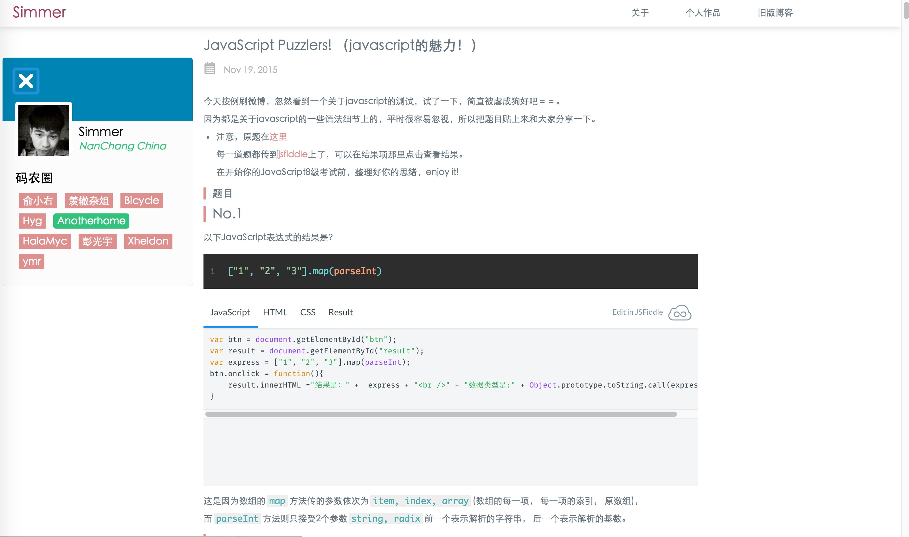
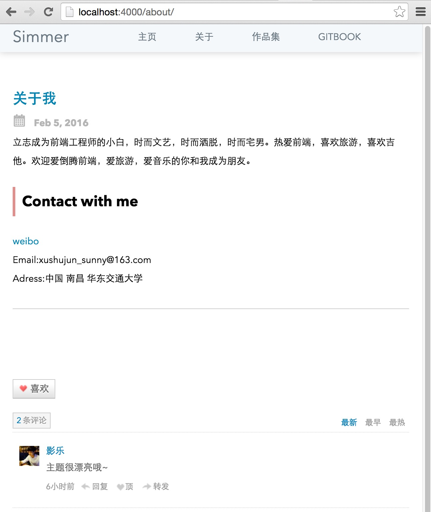

# hexo-theme-grace

一个十分简单的hexo主题，去掉所有我认为不需要的东西，能让你安心于展示内容。

An simple hexo theme.

 - 可以访问我的[博客](http://hisimmer.com/)预览
 - [Preview online ](http://hisimmer.com/)

## Preview 

 - 
 - 

## Begain 

### Install

```bash
$ cd your-hexo-site

$ git clone https://github.com/iissnan/hexo-theme-grace

// install jade template 
npm install hexo-renderer-jade --save     

```

### Enable

* 克隆/下载 完成后，打开 站点配置文件，找到`theme`，改成 `theme: grace`

* Modify `theme` setting in `_config.yml` to `theme: grace`

打开`shell`命令窗口，cd到博客目录执行`hexo server`, 打开浏览器输入`http://localhost:4000/` 

欢迎使用你的新主题

## LISCENSE

See [Here](./LICENSE)
