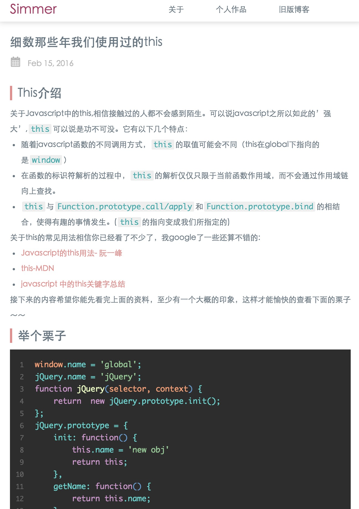
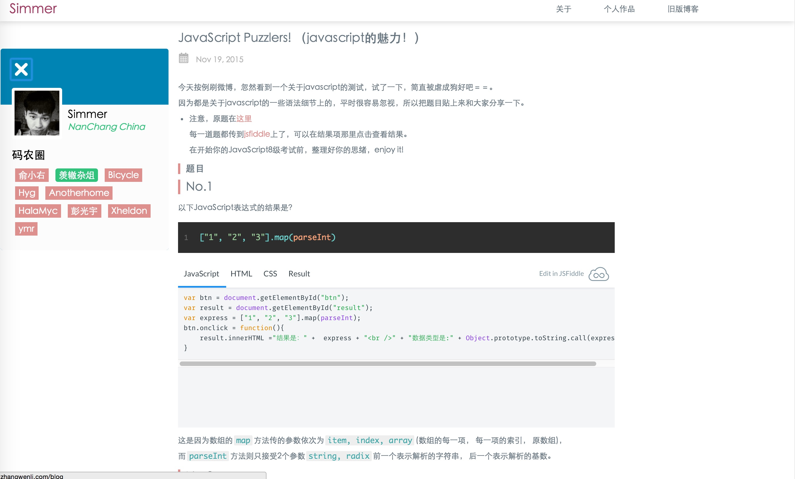

# hexo-theme-grace

一个十分简单，优雅的hexo主题，让你安心于展示内容。

An simple && grace hexo theme - hexo-theme-grace.

 - 可以访问我的[博客](http://hisimmer.com/)预览
 - [Preview online ](http://hisimmer.com/)

## Begain 

### Install

```bash
$ npm install hexo-cli -g
$ hexo init blog
$ cd blog
$ npm install
$ git clone https://github.com/Simmer-Jun/hexo-theme-grace
// install jade template
npm install hexo-renderer-jade --save

```

### Enable

* 克隆/下载 完成后，打开 站点配置文件，找到`theme`，改成 `theme: grace`

* Modify `theme` setting in `_config.yml` to `theme: grace`

打开`shell`命令窗口，进入到博客目录执行`hexo server`, 打开浏览器输入`http://localhost:4000/`

###主题配置项 theme.config

```yml
# Header
menu:
    关于: /about/
    作品集: /demo-pages/
    旧版博客: http://simmerblog.sinaapp.com/

# header left log
log: Simmer

# site favicon
favicon: /images/favicon.ico

#side 侧边栏头像
your_photo: /images/simmer.png

#message 侧边栏个人信息
author: Simer
from: NanChang China

#link  not support now 
link:
   - Twitter
   - Google
   - Facebook
   - Feed
   - Github
# Friend  add your friend link to your site  在侧边栏打开可以看到你的朋友圈
friend:
  俞小右: http://www.iyuxy.com/
  羡辙杂俎: http://zhangwenli.com/blog
  Bicycle: http://helen123.gitcafe.io/
  Hyg: http://gaohaoyang.github.io/about/
  Anotherhome: http://www.anotherhome.net/
  HalaMyc: http://halamyc.me/
  彭光宇: http://iflsy.com/pgy/
  Xheldon: http://www.xheldon.com/
  ymr: https://ymr.me/


# Content
excerpt_link: Read More

# 多说评论true为开启，需要在_config中指定 duoshuo_shortname 
duoshuo: true

```
## Preview





欢迎使用你的新主题 ^(O_o)%

## LISCENSE (MIT)

See [Here](./LICENSE)
